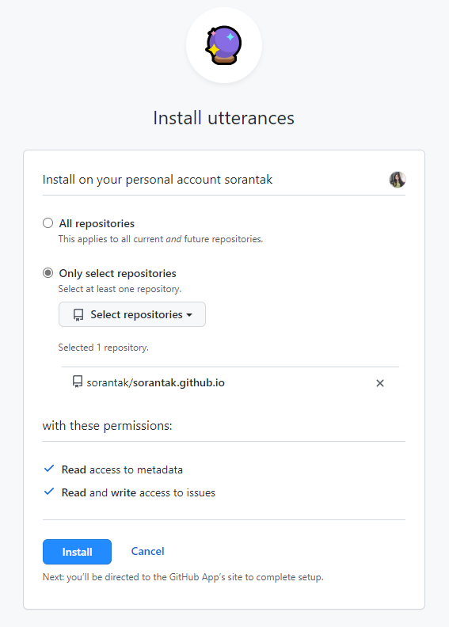
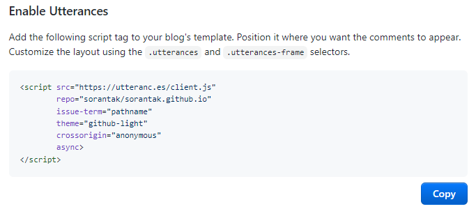
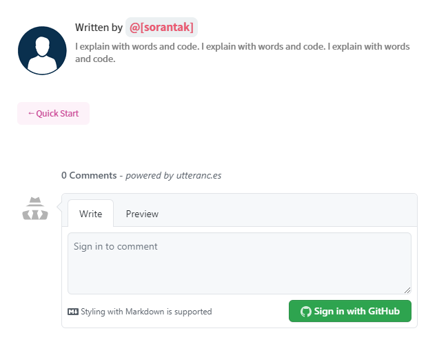

## Install

1. 댓글기능을 추가할 블로그는 이미 만들어졌으며 Github **"public"** repository로 관리되고 있는 상태를 전제로 한다.

2. Github에 로그인한 상태로 아래 링크에 들어가 앱을 다운받는다.

   [utterances](https://github.com/apps/utterances)

## Utterances Composition

3. 댓글기능 추가하고 싶은 레포를 선택하고 설치 버튼을 누른다.
   

4. utterances는 포스트의 url, pathname, title 등등을 추적해서 git issue 기반으로 동작하기 때문에 이 중에 하나를 선택한다.

   나는 pathname으로..

   label, theme 등 옵션 선택을 완료하면 페이지 하단에 나의 선택을 반영한 스크립트가 완성된다.

   

## Blog Setting

5. 위 스크립트를 복사하여 블로그 소스에 추가하면 된다.

   만약, 나와 같이 블로그가 React 기반이라면 컴포넌트를 추가해야 한다.

   난 Jbee님의 [템플릿](https://github.com/JaeYeopHan/gatsby-starter-bee)을 사용했더니 컴포넌트는 이미 추가되어 있음 (크👍👍👍)

   ```jsx
   comment: {
       utterances: 'sorantak/sorantak.github.io',
   }
   ```

   `gatsby-meta-config.js` 파일의 `comment.utterances`의 주석을 풀고 본인의 Github 사용자명과 블로그 레포지토리 주소만 적으면 댓글 영역이 생긴다.

## Finish



TA-DA🥳
