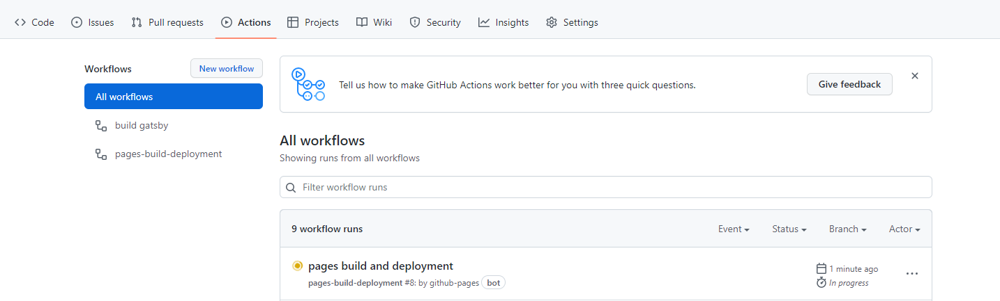

## Install

- git

[https://gitforwindows.org/](https://gitforwindows.org/)

- node.js

[https://nodejs.org/en/](https://nodejs.org/en/)

```bash
node --version
```

- gatsby

```bash
npm install -g gatsby-cli
# -g 옵션은 패키지를 전역에서 참조할 수 있게 함
# 설치되면 다음 경로에서 확인 가능 (windows)
C:\Users\{username}\AppData\Roaming\npm\node_modules\gatsby-cli
```

- gh-pages

```bash
npm i gh-pages --save-dev
```

## Create Project

1. `gatsby-starter-bee` 템플릿 사용

   ```bash
   gatsby new {projectname} https://github.com/JaeYeopHan/gatsby-starter-bee
   ```

2. Github 레포지토리 생성 후 업로드

## Run

```bash
cd {projectname}
gatsby develop
```

[http://localhost:8000/](http://localhost:8000/) 접속하여 변경사항 확인

<aside>
💡 Build & Deploy 는 Github Pages를 사용한다 (Netlify 사용 안함)

</aside>

## Build

1. `package.json` 파일에 해당 내용 추가

   ```json
   "scripts": {
   	"deploy": "gatsby build && gh-pages -d public -b gh-pages"
   }
   ```

2. 프로덕션용 정적 사이트를 빌드

   ```bash
   npm run build
   ```

   1. 위 명령어를 실행하면 package.json에 입력해놓은 것과 같이 gatsby build가 실행됨으로 인해 /public 경로에 정적 파일들이 생성된다

## Deploy

```bash
npm run deploy
```

1. 위 명령어를 실행하면 package.json에 입력한 두 줄의 코드가 실행된다
2. 두 번째 줄 명령어로 gh-pages 명령어를 사용하게 되며 -d는 /public 경로 하위의 모든 내용을 publish 함을 의미하고 -b는 push할 원격저장소의 브랜치를 의미한다 (gh-pages 브랜치가 default이며 변경 가능하다)
3. 작업이 완료되면 마지막 줄에 `Published` 라고 뜬다
4. 실제로 Github 원격 gh-pages 브랜치에 가면 빌드된 정적 파일들이 업로드된 것을 확인할 수 있다
5. 신기하게 원격 gh-pages에 push될 때 Github Actions가 동작한다 왠지 gh-pages 라이브러리가 알아서 해주는 것 같음
   
   Ref.

[https://www.npmjs.com/package/gh-pages](https://www.npmjs.com/package/gh-pages)

1. `{username}.github.io` 도메인 사용하기

   1. 레포지토리 > Settings > Pages 메뉴에 Github가 무료로 제공하는 도메인 설정이 되어 있다
   2. 기본적으로는 Source가 master 브랜치의 루트경로로 설정되어 있어서 `readme.md` 파일을 보여주는 것이다
   3. 브랜치를 gh-pages로 변경, 경로는 그대로 루트경로로 설정하면 해당 도메인으로 접속 시 올려놓은 public 하위의 정적 페이지들이 보이는 것을 확인할 수 있다

   Ref.

   [https://dailyco.tech/share/gatsby-blog-deploy/](https://dailyco.tech/share/gatsby-blog-deploy/)

<aside>
🤔 궁금한 것은.. 로컬에서 작업을 끝내고 gh-pages 명령어를 사용하면 프로덕션까지 배포가 되는건데.. (through Github Actions)

그럼 마스터 브랜치에 남아있는 변경사항은 로컬에만 계속 남겨놔야 하는 것인지

관리를 위하여 포스트에 맞춰 커밋을 해놔야 하는건가

</aside>

## How to Post

1.  ```bash
    npm install -D gatsby-post-gen

    # 다음과 같은 오류 발생할 경우
    # npm ERR! code ERESOLVE
    # npm ERR! ERESOLVE could not resolve
    npm install -D gatsby-post-gen --save --legacy-peer-deps
    ```

2.  `package.json`

    ```json
    "scripts": {
    	"create": "gatsby-post-gen",
    }
    ```

3.  ```bash
    npm run post
    # 또는
    npm run create
    ```

4.  다음과 같은 형식을 갖춘 새 md 파일이 생성됨

    ```markdown
    ---
    title: Gatsby + Github Pages로 블로그 만들기
    date: 2022-07-05 16:07:65
    category: etc
    thumbnail: { thumbnailSrc }
    draft: false
    ---
    ```
